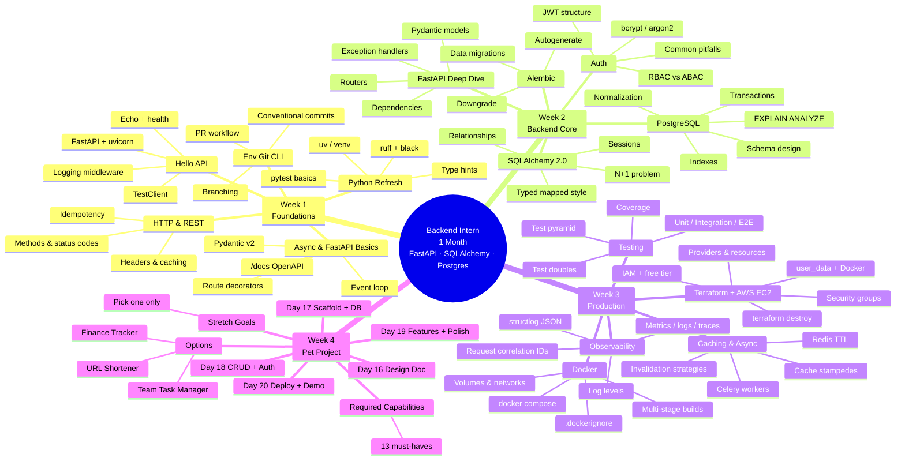

# Course Mindmap

Two views of the same curriculum:

1. **Mindmap view** — visual overview of all topics. Not clickable, but renders in any Mermaid viewer (GitHub, Obsidian, Notion).
2. **Navigation graph** — clickable hub-and-spoke. Each node jumps to the relevant doc or anchor.

For the full interactive experience, open [`course-map.html`](./course-map.html) in a browser — that renders both diagrams with full click support.

---

## 1. Mindmap View (visual)

---

## 2. Navigation Graph (clickable)

```mermaid
graph LR
    Root([Backend Intern<br/>1-Month Course]):::root

    Root --> W1[Week 1<br/>Foundations]:::week
    Root --> W2[Week 2<br/>Backend Core]:::week
    Root --> W3[Week 3<br/>Production]:::week
    Root --> W4[Week 4<br/>Pet Project]:::week
    Root --> Spec[Pet Project<br/>Spec]:::ref
    Root --> Rubric[Evaluation<br/>Rubric]:::ref
    Root --> Res[Resources]:::ref

    W1 --> W1D1[Day 1 · Env & Git]:::day
    W1 --> W1D2[Day 2 · Python]:::day
    W1 --> W1D3[Day 3 · HTTP & REST]:::day
    W1 --> W1D4[Day 4 · Async + FastAPI]:::day
    W1 --> W1D5[Day 5 · Hello API]:::day

    W2 --> W2D1[Day 6 · FastAPI Deep Dive]:::day
    W2 --> W2D2[Day 7 · PostgreSQL]:::day
    W2 --> W2D3[Day 8 · SQLAlchemy]:::day
    W2 --> W2D4[Day 9 · Alembic]:::day
    W2 --> W2D5[Day 10 · Auth]:::day

    W3 --> W3D1[Day 11 · Testing]:::day
    W3 --> W3D2[Day 12 · Logging]:::day
    W3 --> W3D3[Day 13 · Docker]:::day
    W3 --> W3D4[Day 14 · Caching]:::day
    W3 --> W3D5[Day 15 · Terraform + EC2]:::day

    W4 --> W4D1[Day 16 · Design]:::day
    W4 --> W4D2[Day 17 · Scaffold]:::day
    W4 --> W4D3[Day 18 · CRUD+Auth]:::day
    W4 --> W4D4[Day 19 · Polish]:::day
    W4 --> W4D5[Day 20 · Demo]:::day

    click W1 "./week-1-fundamentals.md" "Week 1 plan"
    click W2 "./week-2-backend-core.md" "Week 2 plan"
    click W3 "./week-3-advanced.md" "Week 3 plan"
    click W4 "./week-4-pet-project.md" "Week 4 plan"
    click Spec "./pet-project-spec.md" "Pet project spec"
    click Rubric "./evaluation-rubric.md" "Evaluation rubric"
    click Res "./resources.md" "Resources"

    click W1D1 "./week-1-fundamentals.md#day-1--environment-shell--git" "Day 1"
    click W1D2 "./week-1-fundamentals.md#day-2--python-refresher" "Day 2"
    click W1D3 "./week-1-fundamentals.md#day-3--http--rest" "Day 3"
    click W1D4 "./week-1-fundamentals.md#day-4--async-python--fastapi-fundamentals" "Day 4"
    click W1D5 "./week-1-fundamentals.md#day-5--hello-api-week-1-deliverable" "Day 5"

    click W2D1 "./week-2-backend-core.md#day-6--fastapi-deep-dive" "Day 6"
    click W2D2 "./week-2-backend-core.md#day-7--postgresql-fundamentals" "Day 7"
    click W2D3 "./week-2-backend-core.md#day-8--sqlalchemy-20" "Day 8"
    click W2D4 "./week-2-backend-core.md#day-9--alembic-migrations" "Day 9"
    click W2D5 "./week-2-backend-core.md#day-10--authentication--authorization" "Day 10"

    click W3D1 "./week-3-advanced.md#day-11--automated-testing" "Day 11"
    click W3D2 "./week-3-advanced.md#day-12--logging-errors-observability" "Day 12"
    click W3D3 "./week-3-advanced.md#day-13--docker--docker-compose" "Day 13"
    click W3D4 "./week-3-advanced.md#day-14--caching--async-work" "Day 14"
    click W3D5 "./week-3-advanced.md#day-15--deploying-to-aws-ec2-with-terraform" "Day 15"

    click W4D1 "./week-4-pet-project.md#day-16--design" "Day 16"
    click W4D2 "./week-4-pet-project.md#day-17--scaffold--database" "Day 17"
    click W4D3 "./week-4-pet-project.md#day-18--core-crud--auth" "Day 18"
    click W4D4 "./week-4-pet-project.md#day-19--secondary-features--polish" "Day 19"
    click W4D5 "./week-4-pet-project.md#day-20--deploy--demo" "Day 20"

    classDef root fill:#1e3a8a,color:#fff,stroke:#1e40af,stroke-width:3px
    classDef week fill:#2563eb,color:#fff,stroke:#1d4ed8,stroke-width:2px
    classDef day fill:#dbeafe,color:#1e3a8a,stroke:#3b82f6
    classDef ref fill:#fef3c7,color:#92400e,stroke:#f59e0b
```

