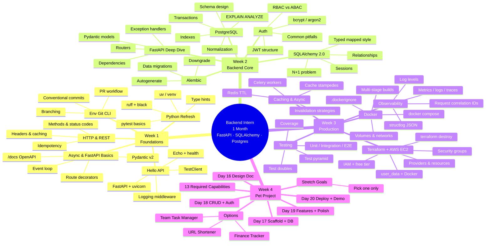

# Course Mindmap & Navigation

Three views of the same curriculum, each optimized for where you'll view it:

| View | Best for | Clickable? |
|------|----------|------------|
| 1. **Mindmap (visual)** below | GitHub, Notion, Obsidian, Confluence | No — visual only |
| 2. **Quick navigation** below | GitHub, terminal markdown viewers, anywhere | ✅ Yes |
| 3. [`course-map.html`](./course-map.html) (open in browser) | Local development / Pages | ✅ Yes — click nodes in the diagram |

> **Note:** GitHub renders Mermaid diagrams but *strips* `click` directives for security. That's why the visual mindmap below shows topics but doesn't link; use the **Quick navigation** section below for clickable jumps, or open `course-map.html` for the full interactive diagram.

---

## 1. Mindmap View (visual)



---

## 2. Quick Navigation (clickable in GitHub)

### 📘 Week 1 — Foundations
Goal: Get fluent with Python, Git, HTTP, and FastAPI basics. → [Week overview](./week-1-fundamentals.md)

| Day | Topic | Key concepts |
|-----|-------|--------------|
| [Day 1](./days/day-01-environment-git.md) | Environment, Shell & Git | pyenv, uv, Git mental model, conventional commits |
| [Day 2](./days/day-02-python-refresher.md) | Python Refresher | type hints, pytest, ruff, pre-commit |
| [Day 3](./days/day-03-http-rest.md) | HTTP & REST | methods, status codes, idempotency, CORS |
| [Day 4](./days/day-04-async-fastapi.md) | Async + FastAPI Fundamentals | event loop, Pydantic, OpenAPI |
| [Day 5](./days/day-05-hello-api.md) | **Hello API** *(deliverable)* | project layout, middleware, env config, tests |

### 📗 Week 2 — Backend Core
Goal: Real REST API with FastAPI + SQLAlchemy + Postgres + JWT auth. → [Week overview](./week-2-backend-core.md)

| Day | Topic | Key concepts |
|-----|-------|--------------|
| [Day 6](./days/day-06-fastapi-deep-dive.md) | FastAPI Deep Dive | routers, dependencies, exception envelope, services layer |
| [Day 7](./days/day-07-postgresql.md) | PostgreSQL Fundamentals | schema design, indexes, `EXPLAIN ANALYZE`, transactions |
| [Day 8](./days/day-08-sqlalchemy.md) | SQLAlchemy 2.0 | typed `Mapped`, async sessions, N+1, `selectinload` |
| [Day 9](./days/day-09-alembic.md) | Alembic Migrations | autogenerate, data migrations, downgrade, CI check |
| [Day 10](./days/day-10-auth.md) | **Auth** *(deliverable)* | bcrypt, JWT, OAuth2, RBAC dependency |

### 📙 Week 3 — Production
Goal: Tested, observable, deployable service. → [Week overview](./week-3-advanced.md)

| Day | Topic | Key concepts |
|-----|-------|--------------|
| [Day 11](./days/day-11-testing.md) | Automated Testing | pytest fixtures, rollback pattern, coverage |
| [Day 12](./days/day-12-logging.md) | Logging & Observability | structlog, correlation IDs, log levels |
| [Day 13](./days/day-13-docker.md) | Docker & Compose | multi-stage builds, healthchecks, non-root |
| [Day 14](./days/day-14-caching.md) | Caching & Async Work | Redis cache-aside, TTL, invalidation, Celery |
| [Day 15](./days/day-15-terraform-ec2.md) | **Terraform + AWS EC2** *(deliverable)* | IaC, free tier, IAM, deploy via user_data |

### 📕 Week 4 — Pet Project
Goal: Apply everything in a 5-day capstone. → [Week overview](./week-4-pet-project.md)

| Day | Topic | Deliverable |
|-----|-------|-------------|
| [Day 16](./days/day-16-pet-design.md) | Design | DESIGN.md approved by mentor |
| [Day 17](./days/day-17-pet-scaffold.md) | Scaffold + DB | Repo skeleton, models, first migration, CI |
| [Day 18](./days/day-18-pet-crud-auth.md) | CRUD + Auth | Working auth + primary resource + tests |
| [Day 19](./days/day-19-pet-polish.md) | Polish | Secondary features, cache, 70% coverage |
| [Day 20](./days/day-20-pet-demo.md) | **Deploy + Demo** *(final exam)* | Public URL + demo + Q&A |

### 📚 Reference

- [Pet Project Spec](./pet-project-spec.md) — three project options + 13 required capabilities
- [Evaluation Rubric](./evaluation-rubric.md) — how the mentor scores the program
- [Resources](./resources.md) — curated reading list
- [Course Map (HTML)](./course-map.html) — interactive version with clickable diagram nodes

---

## 3. Interactive Diagram (HTML)

For the full click-on-the-diagram experience — pan, zoom, every node opens its lesson — open [`course-map.html`](./course-map.html) in a browser:

```bash
open /Users/viethoang/Workspace/investstream/intern-training/course-map.html
```

Or serve the directory and open it from `http://localhost:8000/course-map.html` if you want to host it as a static page.
