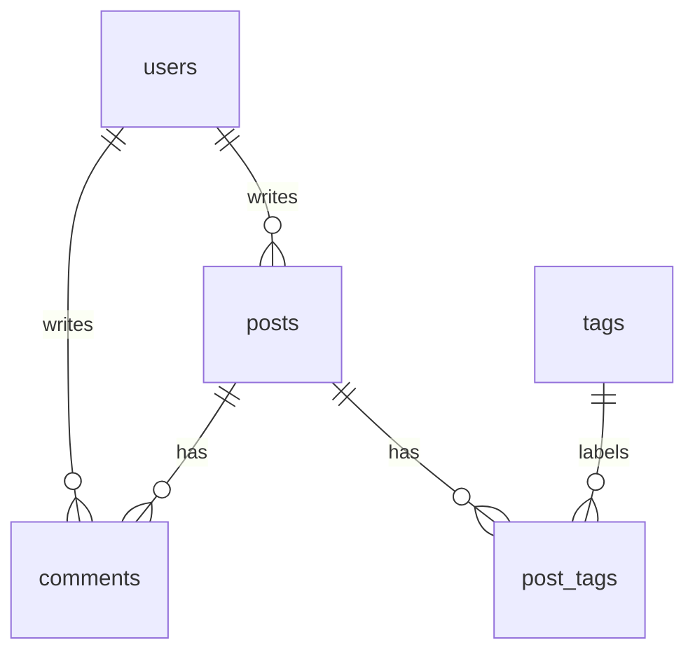

# Day 7 ER Diagram

## Tables

- `users`: tài khoản/author của blog.
- `posts`: bài viết, mỗi bài thuộc về một user.
- `comments`: bình luận trong bài viết, có thể giữ lại nếu author bị xóa.
- `tags`: danh sách tag duy nhất.
- `post_tags`: bảng join cho quan hệ many-to-many giữa posts và tags.

## Decisions

- `posts.user_id ON DELETE CASCADE`: trong bài tập này, post không nên tồn tại nếu owner bị xóa.
- `comments.post_id ON DELETE CASCADE`: comment phụ thuộc vào post, nên xóa post thì xóa comments của post đó.
- `comments.user_id ON DELETE SET NULL`: giữ lịch sử comment khi user bị xóa, nhưng author trở thành `NULL`.
- `tags.name UNIQUE`: tránh duplicate tag như hai row cùng tên `python`.
- `post_tags PRIMARY KEY (post_id, tag_id)`: chặn gắn cùng một tag vào cùng một post nhiều lần.
